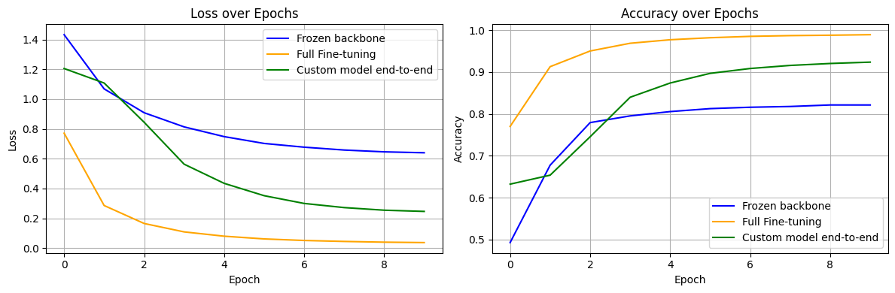

# ATIS Multi-Task Transformer

A minimal PyTorch & Transformers example for joint **intent classification** & **slot tagging** on the ATIS dataset.

This repo show cases comparison between multiple strategies of training multi task learning



## Requirements

See `requirements.txt` for full list. At minimum:
- Python 3.7+
- torch >= 1.12.0
- transformers >= 4.18.0
- scikit-learn >= 1.0.0
- pandas >= 1.3.0
- matplotlib >= 3.4.0
- tqdm >= 4.60.0

## Installation

```bash
git clone https://github.com/Biswajit-Banerjee/multi_task_nlp.git
cd multi_task_nlp
pip install -r requirements.txt

```


### Dataset Overview

This project uses a **curated subset** of the Airline Travel Information System (ATIS) corpus. Each example consists of a user’s flight-related utterance, annotated with:

- **Intent**: the user’s overall goal (e.g. searching for flights, checking fares).  
- **Entities**: token-level labels indicating semantic categories (e.g. cities, times).

---

##### Example Record

```json
{
  "text":    "i need a flight tomorrow from columbus to minneapolis",
  "entities":["X","X","X","X","DateTime","X","Location","X","Location"],
  "intent":  "Flight"
}
```
---